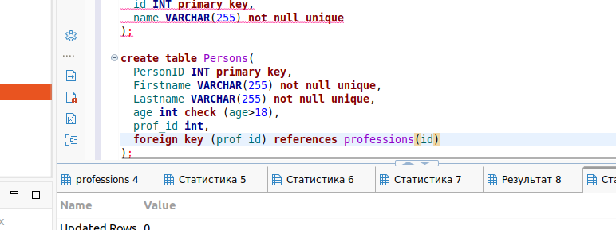

# Домашнее задание к занятию «Базы данных» Шелухин Юрий

### Легенда
Заказчик передал вам [файл в формате Excel](https://github.com/netology-code/sdb-homeworks/blob/main/resources/hw-12-1.xlsx), в котором сформирован отчёт. 
На основе этого отчёта нужно выполнить следующие задания.

### Задание 1

Опишите не менее семи таблиц, из которых состоит база данных:
- какие данные хранятся в этих таблицах;
- какой тип данных у столбцов в этих таблицах, если данные хранятся в PostgreSQL.

Приведите решение к следующему виду:
Сотрудники (
- идентификатор, первичный ключ, serial,
- фамилия varchar(50),
- ...
- идентификатор структурного подразделения, внешний ключ, integer).
---

#### Решение 1.
1. База данных состоит из данных числовых, строковых, 
2. Таблицы, из которых состоит база данных:
ФИО сотрудника -	VARCHAR 	
Оклад 	- MONEY 	
Должность 	- VARCHAR 	
Тип подразделения 	- VARCHAR 	
Структурное подразделение -VARCHAR 	
Дата найма 	- DATE 	
Адрес филиала 	- VARCHAR 	
Проект, на который назначен - VARCHAR 	
3. [файл в формате Excel](files/hw-12-1.xlsx)
---

### Задание 2*

Перечислите, какие, на ваш взгляд, в этой денормализованной таблице встречаются функциональные зависимости и какие правила вывода нужно применить, чтобы нормализовать данные.

---

#### Решение 2*.
Примеры имеющихся зависимостей:
    оклад- от сотрудника;
    адрес филиала- от структурного подраздления;
Для нормализации данных нужно:
    сделать значения атомарными (проекты, на которые назначен);
    создать идентификатор с первичным ключем для сотрудника;
    убрать избыточность данных;
    раздробить таблицу.

---

### Для себя. Работа с DBeaver.
Для себя:
`docker run --name pg-test -p 5432:5432 -e POSTGRES_PASSWORD=postgres -d postgres:latest`  
Установим Python версии 3 и библиотеку Pika.   
 
 

 
 
 
 

 
 

 
 

 
 

 

---
